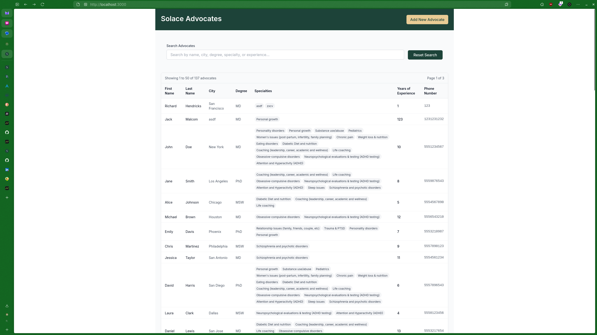

# Discussion

This was a fun take home project to work on. You guys did a great job putting everything together!

## Todos

- The admin panel for adding advocates obviously doesn't have auth and is exposed to the public route. This was done for testing, but obviously this functionality would need to be put somewhere else.
- I wish I had more time to focus on the styling of the app. I stole the color palette on solace.health as a starting place, but I wish I had time to work in more features of your branding such as fonts and logos, and layout to make it feel unique.
- Filtering is still done by checking every field against the search term. It would be better to add more advanced search features especially for the specialties field. I assume most users don't know the exact advocate they're looking for, so I would probably center the search around filtering if I had more time to think about my design. There are other parts of the search that can probably be omitted to improve backend performance like phone number.
- The spacing of the table is a bit lacking. It would be better to allow specialties to overflow, then allow the user to expand the row to see the full list. This could be coupled with the specialty filtering I mentioned in the last point to highlight filtered specialties, and move them to the top of the list for better UX.
- Since searching advocates would probably lead to people signing up for your service in the real world, it would be good to add some sort of call to action when a user hovers/expands a row.
- If advocates are intended to be met in person, it would be good to add some sort of geographic filtering to the search. This could use PostGIS for search, which integrates well with Drizzle.
- The loading UI could be improved a bit. I currently just display loading text above the results to avoid obstructing the user's view of the table. It would probably be better to display an animation instead.

## Screenshot

